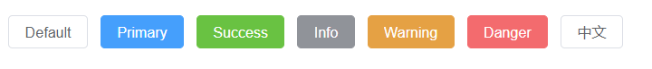
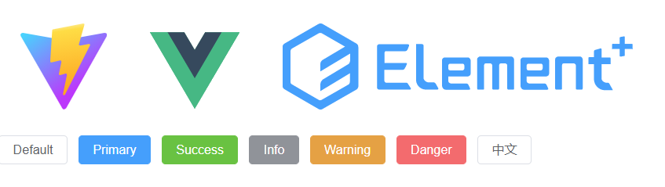
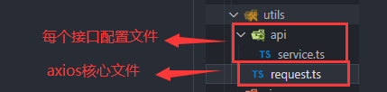

# Vue 3 + TypeScript + Vite + Element-Plus
# 安装Vue3+ts+vite
```
npm init vite@latest
```
选择y,新建项目名称,选择vue,选择vue-ts
下载完成后执行以下命令行
```
cd 新建的项目名称
npm i
npm run dev
```
# 安装Element-Plus
```
npm install element-plus --save
```
安装完后给main.ts配置以下代码
```ts
import { createApp } from 'vue'
import ElementPlus from 'element-plus';
import 'element-plus/dist/index.css'
import App from './App.vue'
createApp(App).use(ElementPlus).mount('#app')
```
在 tsconfig.json 中通过 compilerOptions.type 指定全局组件类型。
```json
// tsconfig.json
{
  "compilerOptions": {
    "types": ["element-plus/global"]
  }
}
```
## 自动导入两款插件使用方法
```
#选择一个你喜欢的包管理器
 
#NPM
# npm install -D unplugin-vue-components unplugin-auto-import
 
#Yarn
$ yarn add -D unplugin-vue-components unplugin-auto-import
```
安装完成后打开vite.config.ts文件，复制以下代码到vite.config.ts里

```ts
import { defineConfig } from 'vite'
import vue from '@vitejs/plugin-vue'
import AutoImport from 'unplugin-auto-import/vite'
import Components from 'unplugin-vue-components/vite'
import { ElementPlusResolver } from 'unplugin-vue-components/resolvers'

export default defineConfig({
  plugins: [
    vue(),
    AutoImport({
      resolvers: [ElementPlusResolver()],
    }),
    Components({
      resolvers: [ElementPlusResolver()],
    }),]
})
```
在页面中渲染
```ts
    <el-button>Default</el-button>
    <el-button type="primary">Primary</el-button>
    <el-button type="success">Success</el-button>
    <el-button type="info">Info</el-button>
    <el-button type="warning">Warning</el-button>
    <el-button type="danger">Danger</el-button>
    <el-button>中文</el-button>
```
效果如下：

************
# 引入router，axios，Pinia
## 一、安装router
```
npm install vue-router
```
在src下新建router文件夹/index.ts
配置内容如下：
```ts
import { createRouter, createWebHistory, RouteRecordRaw } from 'vue-router'
import Home from '../view/Home.vue';
const routes: Array<RouteRecordRaw> = [
  {
    path: '/',
    name: 'index',
    component: Home,
  },
]
const router = createRouter({
  history: createWebHistory(),
  routes
})
export default router;
```
main.ts添加router
```ts
import { createApp } from 'vue'
import ElementPlus from 'element-plus';
import 'element-plus/dist/index.css'
import router from './router/index'
import App from './App.vue'
createApp(App).use(ElementPlus).use(router).mount('#app')
```
### 更改页面结构
在src中新增view文件夹，里面新建Home.vue
```html
<template>
  <div>
    <el-button>Default</el-button>
    <el-button type="primary">Primary</el-button>
    <el-button type="success">Success</el-button>
    <el-button type="info">Info</el-button>
    <el-button type="warning">Warning</el-button>
    <el-button type="danger">Danger</el-button>
    <el-button>中文</el-button>
  </div>
</template>

<script lang='ts'>
import { onBeforeMount, onMounted } from "vue";
export default {
  name: "",
  setup() {},
};
</script>
<style scoped lang='less'>
</style>
```
App.vue页面
```html
<script setup lang="ts">
</script>
<template>
  <div>
    <a href="https://vitejs.dev" target="_blank">
      
    </a>
    <a href="https://vuejs.org/" target="_blank">
      
    </a>
    <a href="https://element-plus.gitee.io/zh-CN/" target="_blank">
      
    </a>
  </div>
  <router-view></router-view>
</template>

<style scoped>
.logo {
  height: 6em;
  padding: 1.5em;
  will-change: filter;
}
.logo:hover {
  filter: drop-shadow(0 0 2em #646cffaa);
}
.logo.vue:hover {
  filter: drop-shadow(0 0 2em #42b883aa);
}
.logo.element:hover {
  filter: drop-shadow(0 0 2em #459FFCaa);
}
</style>

```
效果：


## 二、安装axios
```
npm install axios
pnpm install axios
```
可参考以下封装方法：

request.ts
```ts
import axios from 'axios'

// 创建axios
const service = axios.create({
  // baseURL: '/api',
  baseURL: 'http://xxx.xxx.xx.xxx',
  timeout:80000
});

// 添加请求拦截器
service.interceptors.request.use(
  (config:any) => {
    let token:string =''//此处换成自己获取回来的token，通常存在在cookie或者store里面
    if (token) {
      // 让每个请求携带token-- ['X-Token']为自定义key 请根据实际情况自行修改
      config.headers['X-Token'] = token
   
      config.headers.Authorization =  + token       
     }
    return config
  },
  error => {
    // Do something with request error
    console.log("出错啦", error) // for debug
    Promise.reject(error)
  }
)

service.interceptors.response.use(
  (response:any) => {
   return response.data
 },    /*  */
 error => {
   console.log('err' + error) // for debug
   if(error.response.status == 403){
     // ElMessage.error('错了')
     console.log('错了');
     
   }else{
     // ElMessage.error('服务器请求错误，请稍后再试')
     console.log('服务器请求错误，请稍后再试');
   }
   return Promise.reject(error)
 }
)
export default service;


```
main.ts
```ts
import { createApp, useAttrs } from 'vue'
import ElementPlus from 'element-plus';
import 'element-plus/dist/index.css'
import router from './router/index'
import App from './App.vue'
let app = createApp(App)
import axios from './utils/request'
app.config.globalProperties.$http = axios;
const pinia = createPinia()
app.use(ElementPlus).use(router).mount('#app')
```
service.ts
```ts
import service from "../request"

// 获取seller
export function getSeller(params:any){
  return service.request({
    method:'POST',
    url:'接口一',
    data:params
  })
}
export function Login(params:any){
  return service.request({
    method:'POST',
    url:'接口二',
    data:params
  })
}
```
页面调用
```ts
// 接口引入地址
import { getTest} from "../utils/api/service";

/* 调用接口 */
       getTest('放入params参数').then(response => {
            console.log("结果", response);
          })
          .catch(error => {
            console.log('获取失败！')
          });
```
## 三、安装Pinia
```
npm add pinia@next
```
### 挂载Pinia
main.ts
如果按照上面步骤来的话可以直接替换main.ts
```ts
import { createApp, useAttrs } from 'vue'
import ElementPlus from 'element-plus';
import 'element-plus/dist/index.css'
import router from './router/index'
import App from './App.vue'
import {createPinia} from 'pinia'
let app = createApp(App)
import axios from './utils/request'
app.config.globalProperties.$http = axios;
const pinia = createPinia()
app.use(ElementPlus).use(pinia).use(router).mount('#app')
```

新建store文件夹/userCount.ts
```ts
import { defineStore } from 'pinia'
// defineStore( ) 方法的第一个参数：相当于为容器起一个名字。注意：这里的名字必须唯一，不能重复。
export const user = defineStore('user', {
    state: () => {
        return {
            num:1
        }
    },
    getters: {

    },
    actions: {

    }
})
```
需要使用的页面里
```html
<template>
    <div>
        {{num}}
    </div>
</template>
<script lang='ts' setup>
    import { useMainStore } from "../../store/module/useCountStore";
    const mainStore = useMainStore();
    console.log(mainStore.count);
</script>
```

# 安装less
```
npm install --save-dev less-loader less
```
直接使用即可。